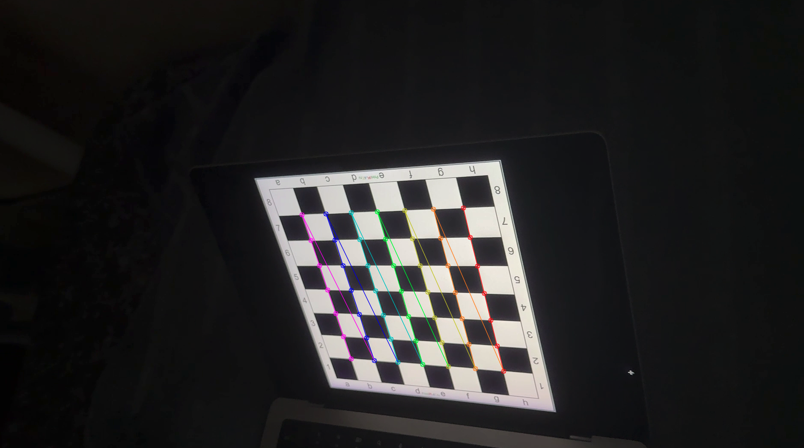
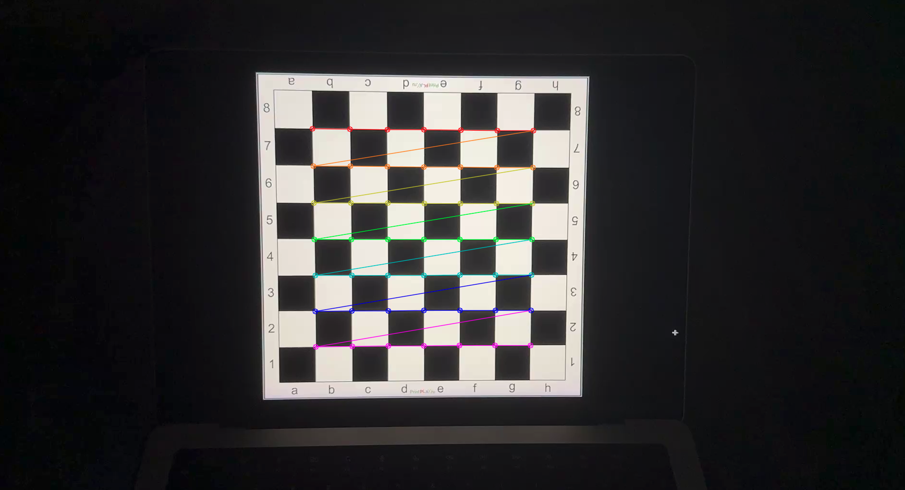
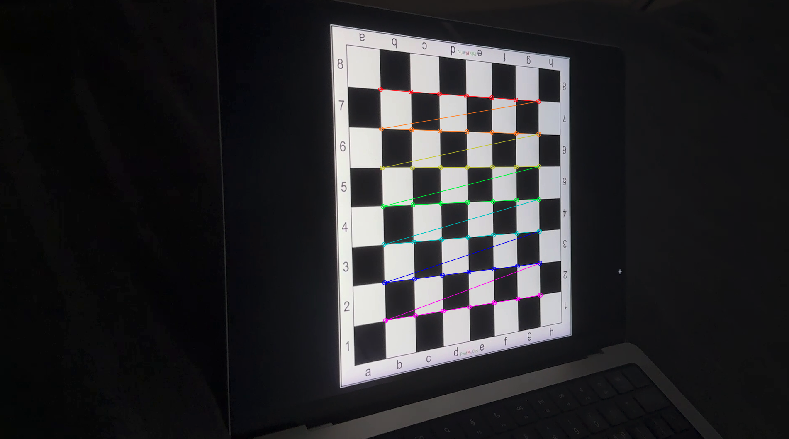
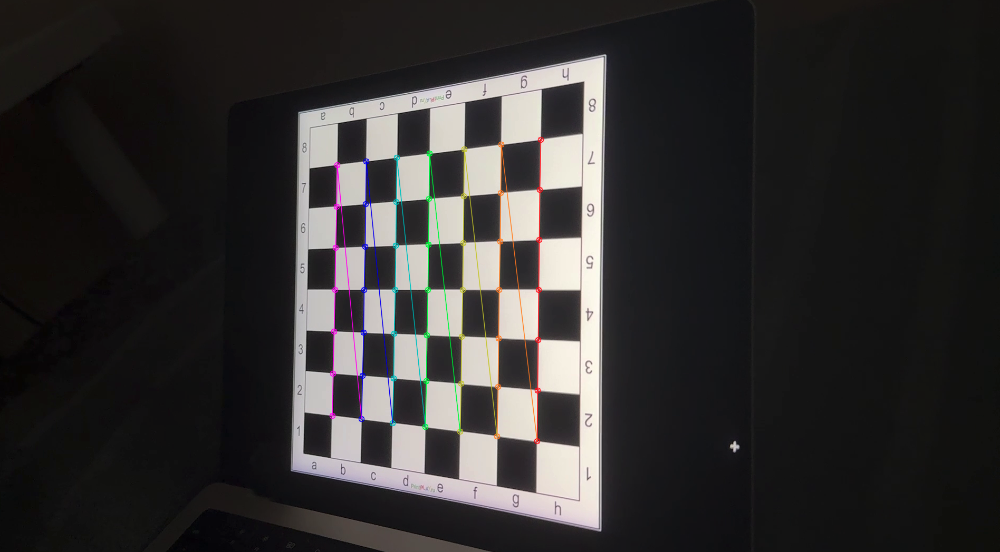
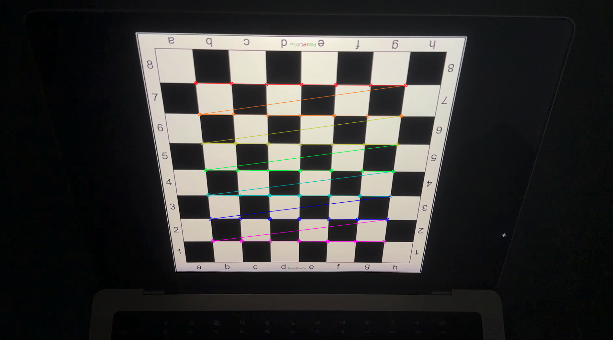
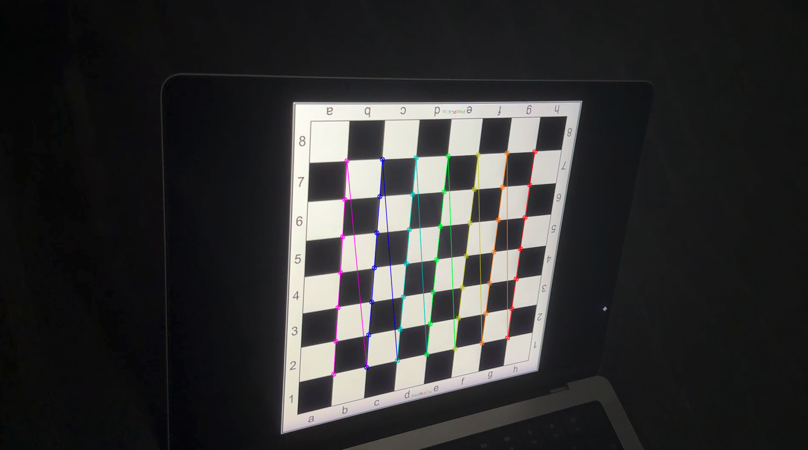

# Результаты работы скрипта

```
Camera matrix :

[[1.66833885e+03 0.00000000e+00 9.64003673e+02]
 [0.00000000e+00 1.66932196e+03 5.48118055e+02]
 [0.00000000e+00 0.00000000e+00 1.00000000e+00]]
dist :

[[ 1.88600582e-01 -3.22305849e-01  1.62428428e-03  1.41282309e-03
  -1.53988962e+00]]
```














